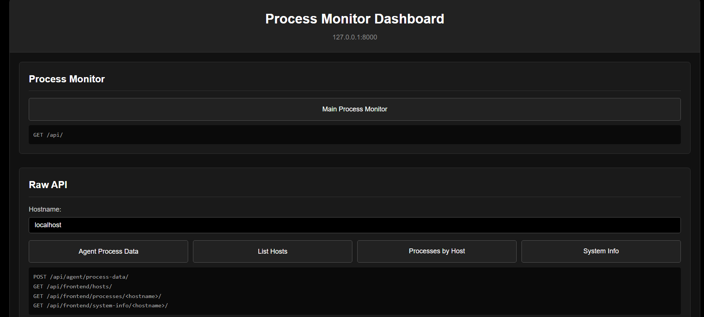

# 🖥️ Process Monitor

A **Django-based process monitoring system** with an agent (EXE) that collects system and process information in real time and pushes it to the backend. The system provides REST APIs, WebSocket support (with Django Channels), and a web dashboard for monitoring hosts.

---

## ✨ Features

* Collects **system info** (CPU, RAM, storage, OS, etc.)
* Collects **process info** (PID, name, CPU usage, memory usage, etc.)
* Backend powered by **Django + Django REST Framework**
* Real-time updates via **Django Channels + WebSockets**
* Standalone **agent executable (.exe)** using `pyinstaller`
* **Secure API key** authentication for agents
* Dashboard with search & monitoring features

---

## ⚙️ Installation

### 1️⃣ Clone the Repository

```bash
git clone https://github.com/Shadowsweep/process_monitoring_system.git
cd process_monitor
```

### 2️⃣ Create Virtual Environment

```bash
python -m venv venv
source venv/bin/activate   # On Windows: venv\Scripts\activate
```

### 3️⃣ Install Dependencies

```bash
pip install -r requirements.txt
```

### 4️⃣ Apply Migrations

```bash
python manage.py makemigrations
python manage.py migrate
```

### 5️⃣ Run Development Server

```bash
python manage.py runserver
```

---

## 🗄️ Database Schema

We use three models: **Host**, **Process**, and **SystemInfo**.

```python
class Host(models.Model):
    hostname = models.CharField(max_length=255, unique=True)
    last_seen = models.DateTimeField(auto_now=True)

class Process(models.Model):
    host = models.ForeignKey(Host, on_delete=models.CASCADE, related_name='processes')
    timestamp = models.DateTimeField()
    pid = models.IntegerField()
    ppid = models.IntegerField()
    name = models.CharField(max_length=255)
    cpu_percent = models.FloatField()
    memory_mb = models.FloatField()

class SystemInfo(models.Model):
    host = models.OneToOneField(Host, on_delete=models.CASCADE, related_name='system_info')
    os_name = models.CharField(max_length=255)
    processor = models.CharField(max_length=255)
    num_cores = models.IntegerField()
    ram_total_gb = models.FloatField()
    storage_total_gb = models.FloatField()
```

---

## 🤖 Agent

The **Agent** is a Python script (`agent.py`) that:

* Collects **system info** & **process info** using `psutil`
* Sends data to backend every few seconds
* Uses **secure API key authentication**

Run the agent manually:

```bash
python agent.py
```

Or build as an EXE:

```bash
pyinstaller --onefile agent.py
```

This generates `dist/agent.exe` which you can run directly , also you can view in the console when the code is running .

---

## 🔑 Hostname & API Key

We use `check_hostname.py` to:

* Get current machine hostname
* Generate a **secure 256-bit API key**

```bash
python check_hostname.py
```

Example:

```
Hostname: LAPTOP-123
Secure API Key: 6566ad98157118e80a26f9e79041df093b7a6b15496286c6d44e921ec22e1a34
```

---

## 🔌 WebSocket Implementation

We integrated **Django Channels** for real-time monitoring.

* WebSocket server powered by **Daphne**
* Sends system + process updates every **1 second**
* Uses `HostMonitorConsumer` in `consumers.py`

Start WebSocket server:

```bash
daphne -p 8001 process_monitor.asgi:application
```

---

## 📊 Dashboard

The dashboard provides:

* Host listing
* System info & process details
* Search feature
* Real-time updates (when agent is running)

Access:

```
http://localhost:8000/
```

---

## 🚀 Usage

1. Start Django backend:

   ```bash
   python manage.py runserver
   ```

2. Run Daphne for WebSockets:

   ```bash
   daphne -p 8001 process_monitor.asgi:application
   ```

3. Start the agent (`agent.py` or `agent.exe`).

4. Open the dashboard in your browser:

   ```
   http://localhost:8000/
   ```

---

## 📷 Screenshots (Add Here)

* Dashboard view


* Demo video

<video controls src="20250817-0521-36.5525800.mp4" title="Title"></video>


---

## Thankyou

---


